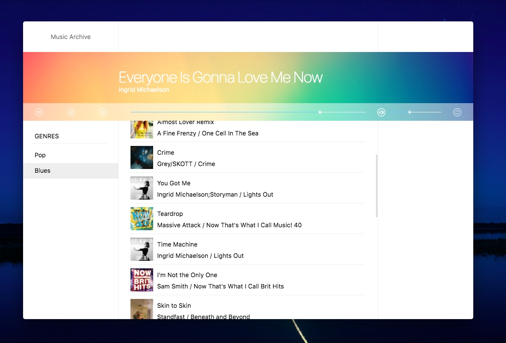

# Music Player

A tool made out of a fantasy of free will.

## Run in Electron

first, you need to get webpack running by `yarn start`, and then run `yarn run electron`

## Develop

When adding a dependency, if it will be used in main process, use `yarn add <PACKAGE>`, otherwise use `yarn add <PACKAGE> -D` to add it to devDependencies.

## Distribution

This project use [electron-packager](https://www.npmjs.com/package/electron-packager) to package this app.  Run `yarn run package`.

## Docs 

See [docs](./docs)

## This project CAN NOT be done without

- [SoundManager2](http://www.schillmania.com/projects/soundmanager2/)
- [Electron](https://electronjs.org/)
- [Bootstrap](https://getbootstrap.co/)
- [React](https://reactjs.org/)
- [Webpack](https://webpack.js.org/)
- [Babeljs](https://babeljs.io/)
- And some many other brilliant projets by dedicated people
